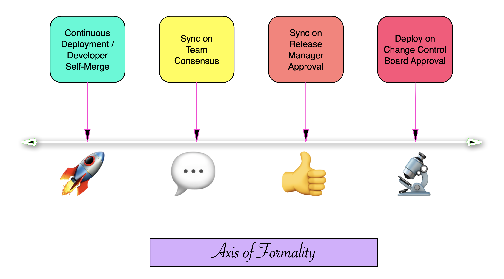

..
  Technote content.

  See https://developer.lsst.io/restructuredtext/style.html
  for a guide to reStructuredText writing.

  Do not put the title, authors or other metadata in this document;
  those are automatically added.

  Use the following syntax for sections:

  Sections
  ========

  and

  Subsections
  -----------

  and

  Subsubsections
  ^^^^^^^^^^^^^^

  To add images, add the image file (png, svg or jpeg preferred) to the
  _static/ directory. The reST syntax for adding the image is

  .. figure:: /_static/filename.ext
     :name: fig-label

     Caption text.

   Run: ``make html`` and ``open _build/html/index.html`` to preview your work.
   See the README at https://github.com/lsst-sqre/lsst-technote-bootstrap or
   this repo's README for more info.

   Feel free to delete this instructional comment.

:tocdepth: 1

.. Please do not modify tocdepth; will be fixed when a new Sphinx theme is shipped.

.. sectnum::

.. TODO: Delete the note below before merging new content to the master branch.

.. note::

   **This technote is not yet published.**

   The aim of this document is to expose the heuristics by which we consider what the appropriate process is for various types of service updates.
   We also describe our extant processes around Science Platform and Science Platform adjacent services, as these are likely to be of most interest to developers outside our team. 

.. Add content here.
.. Do not include the document title (it's automatically added from metadata.yaml).

.. note::
   
   This is a *descriptive* (not prescriptive) document describing details of current practice of a specific team in a specific area. For the actual developer guide, see developer.lsst.io

SQuaRE uses Configuration as Code (aka “gitops”) practices for service deployment whenever practical.
What this means is that by merging code or configuration to a special branch (typically master), it is *possible* to trigger an action (via an agent or supervisory system) that automatically results in the deployment of the new version of the service.

Whether the new version of the service is *actually* deployed automatically (a practice known as continuous deployment) or whose deployment is gated behind a human decision making process is a matter of policy.
The barrier to getting through that gate is itself a function of where a system lies on an axis of formality, with one end maximizing developer agency and the other maximizing organisational control.

Where any one particular instance of any one particular service lies in the Axis of Formality is a function of:

-  The service’s maturity, including the number of users depending on the service
   
-  The service environment, including whether it’s production, staging or development environment
   
-  The service’s userbase, including whether it is a feature-seeking or risk averse population
   
-  The actual and reputational impact of disruptions to the service
   
-  The nature of the change being made.

It’s easy to see that a major change in a mature high visibility service that many users depend on is on the opposite side of the axis that a cosmetic change in a service under development deployed on a sandbox.
The trickier situations lie in between these extremes, and the aim of this document is to expose the heuristics by which we consider these questions.
We also describe our extant processes around the update of Science Platform and Science Platform adjacent services, as these are likely to be of most interest to developers outside our team and since they exercise a lot of the decision space described above.

Kubernetes Services and ArgoCD
------------------------------

SQuaRE develops Kubernetes-based services, and uses the ArgoCD platform to manage their deployment. The ArgoCD UI provides a valuable way both to assess the state of deployed services and to allow basic maintenance operations on deployed services even without being particularly intimate with the details of their deployments, and irrespective whether the underlying service is configured with Helm or kustomize.

.. image:: _static/argocd.png
	   
ArgoCD continuously monitors running services and compares their state with that of their git repo. When it detects that a service is “out of sync” (ie there is drift between its deployed state and the repository state) it can sync automatically (the continuous deployment model) or as in Figure 2, indicate visually the out-of-sync state until an engineer pushes the sync button to resolve it (the gated deployment model).
Generally unless working in a dev or bleed environment, we do not allow ArgoCD to sync automatically.

It follows then that for gated deployments there are two aspects to getting a new version of a service deployed into production:

1. Mechanics: Getting the right version of the service and its configuration merged into the deployment branch (typically master);
2. Process: Going through the process that allows it to be synced into production.

Mechanics
---------

Assume that there is a new release of Gafaelfawr, the authentication service used by the Rubin Science Platform.
The following steps notify Argo CD that this upgrade is ready to be performed:

#. Update the Helm chart in the [charts](https://github.com/lsst-sqre/charts) repository under `charts/gafaelfawr`.
   Do this by updating the `appVersion` key in `Chart.yaml` and the `image.tag` key in `values.yaml` to point to the new release.
   Also update the version of the Helm chart in `Chart.yaml`.
   When this PR is merged, a new version of the chart will be automatically published via GitHub Actions.
#. Update the Argo CD configuration to deploy the new version of the chart.
   The `Chart.yaml` file in `services/gafaelfawr` in the [phalanx](https://github.com/lsst-sqre/phalanx) repository determines what version of the Gafaelfawr chart is installed by Argo CD.
   (Phalanx is the Argo CD configuration repository for the Rubin Science Platform.)
   Under the stanza for the `gafaelfawr` chart in the `dependencies` key, change the version to match the newly-released chart version.
   Once this PR is merged, Argo CD will notice there is a pending upgrade for Gafaelfawr.

Process
-------

The process used to deploy a specific instance of a service depends on where it lies on the axis of formality above. We use the following terminology for the various deployment environments, in decreasing formality:

-  Prod: Production, the user-facing deployment. For historical reasons sometimes referred to as “stable” where the Science Platform is concerned.

-  Int: Integration, a deployment for developers, typically from different teams, to converge upon to test the integration of services prior to deployment on Prod. This is the environment somethings referred to as “staging”. For telescope deployments, this is currently the NCSA Test Stand [NTS]

-  Dev: Development, an instance that is primarily for developer testing. It may not be always available, or there may be several of them.
   
-  Bleed: An environment that is left uncontrolled, either by being continuously deployed from master or by letting otherwise pinned versions of components float up

In some cases work is corralled in routine maintenance windows. This is both to minimize the potential of disruption in high availability environments and to allow co-ordination of work on multiple services and/or infrastructure; and also to issue a “hold off reporting problems” to users.
*Maintenance windows do not imply fixed downtime.*
Downtime (complete service unavailability) is extremely rare and we design our processes to avoid it.
Routine maintenance work involves transient service unavailability at most and in most cases users are not barred from using the system during that time, though they are given notice to save their work and there is always a small chance of unforseen problems.
A co-ordinator is assigned to announce work start and work end and field any questions.

Current fixed maintenance windows (for applicable services/deployments) are:

-  All telescope deployments: 1st Wednesday of every month, late afternoon in Chile (approx 2pm PT), confirmed with the telescope software configuration manager.
-  Any other deployment subject to maintenance window: Weekly, Thursday afternoons (approx 3pm PT).

Again, these are not scheduled downtimes. In the event that extended service downtime is needed in a production service (extremely rare), work would be scheduled out of normal hours with ample notice and co-ordination with stakeholders.

Here is a chart showing the current settled-upon practice in select areas:

+--------------+---+--------+-----------+------------------------------+
| Service      | B | Dev    | Int       | Prod                         |
|  Instance    | l |        |           |                              |
|              | e |        |           |                              |
|              | e |        |           |                              |
|              | d |        |           |                              |
+==============+===+========+===========+==============================+
| Science      | A | Develo | #rsp-team | Release manager has to okay  |
| Platform -   | u | per-at | channel   | on #rsp-team, 24 hour notice |
| Science      | t | -will, | anno      | minimum                      |
| Deployments  | o | no     | uncement, |                              |
| (IDF, LDF,   | m | he     | courtesy  |                              |
| USDF)        | a | ads-up | 1hr       |                              |
|              | t | re     | notice    |                              |
|              | i | quired |           |                              |
|              | c |        |           |                              |
+--------------+---+--------+-----------+------------------------------+
| Science      | N | Develo | #c        | #com-square notice,          |
| Platform -   | / | per-at | om-square | #                            |
| Telescope    | A | -will, | notice,   | summit-testing-announcements |
| Deploym      |   | no     | in        | notice, in maintenance       |
| ents(summit, |   | he     | ma        | window                       |
| base, NTS)   |   | ads-up | intenance |                              |
|              |   | re     | window    |                              |
|              |   | quired |           |                              |
+--------------+---+--------+-----------+------------------------------+
| EFD          | N | Develo | #c        | #com-square notice,          |
|              | / | per-at | om-square | #                            |
|              | A | -will, | notice,   | summit-testing-announcements |
|              |   | no     | in        | notice, in maintenance       |
|              |   | he     | ma        | window                       |
|              |   | ads-up | intenance |                              |
|              |   | re     | window    |                              |
|              |   | quired |           |                              |
+--------------+---+--------+-----------+------------------------------+
| Roundtable   | N | Develo | Developer | If service disruption is     |
| (L           | / | per-at | -at-will, | expected, in maintenance     |
| SST-the-docs | A | -will, | no        | window, notice in relevant   |
| and other    |   | no     | heads-up  | service channels (dm-docs,   |
| non-data     |   | he     | required  | etc). Otherwise at-will.     |
| services),   |   | ads-up |           |                              |
| SQuaSH       |   | re     |           |                              |
|              |   | quired |           |                              |
+--------------+---+--------+-----------+------------------------------+
| commun       | N | N/A    | N/A       | If service disruption is     |
| ity.lsst.org | / |        |           | expected, out-of-hours in    |
|              | A |        |           | co-ordination with           |
|              |   |        |           | #rubinobs-forum-team.        |
|              |   |        |           | Otherwise in maintenance     |
|              |   |        |           | window.                      |
+--------------+---+--------+-----------+------------------------------+

Discussion for the science RSP production era:
----------------------------------------------

  
.. .. rubric:: References

.. Make in-text citations with: :cite:`bibkey`.

.. .. bibliography:: local.bib lsstbib/books.bib lsstbib/lsst.bib lsstbib/lsst-dm.bib lsstbib/refs.bib lsstbib/refs_ads.bib
..    :style: lsst_aa
